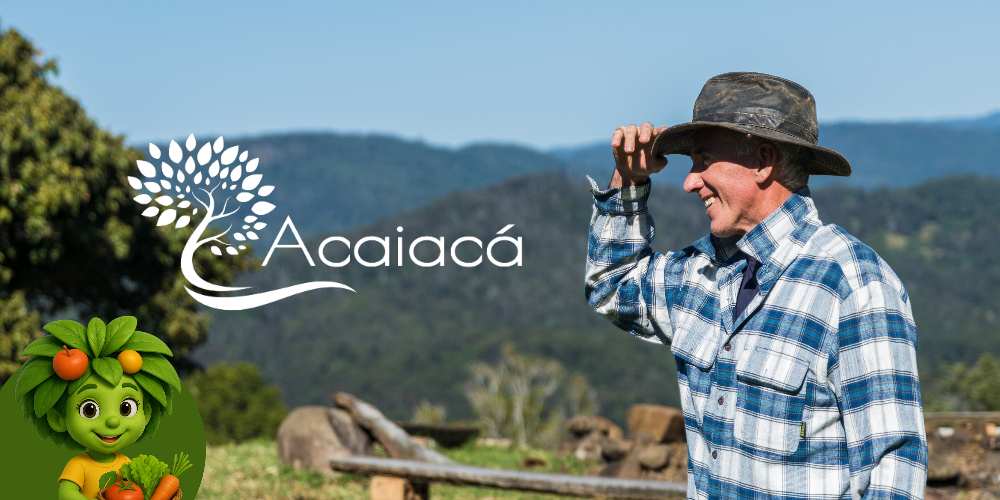
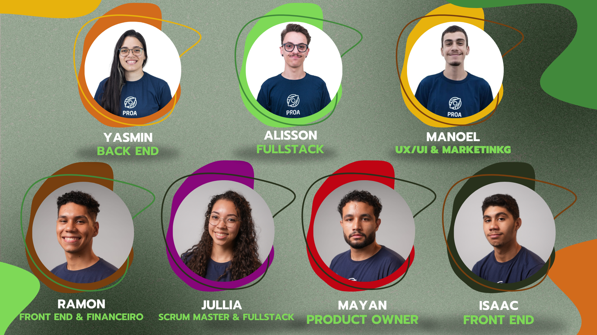

<h1>Acaiacá 🌽</h1>

  

<h2>Sobre nós:</h2>
   

      Pequenos 
   

   <h2>Nossa equipe:</h2>

## 👥 Equipe Acaiacá

<table>
  <tr>
    <td align="center">
      <a href="https://github.com/julliakathelyn">
        
         
        <b> :octocat: Jullia Kathelyn</b>
      </a>
       
      Scrum Master & FullStack
       
      <a href="https://www.linkedin.com/in/jullia-kathelyn/">🔗 LinkedIn</a>
    </td>
    <td align="center">
      <a href="https://github.com/yaslopesyweb">
        
         
        <b>:octocat: Yasmin Lopes</b>
      </a>
       
      Backend
       
      <a href="https://www.linkedin.com/in/yasmin-lopes-devsecops">🔗 LinkedIn</a>
    </td>
    <td align="center">
      <a href="https://github.com/MayanGit">
        
         
        <b>:octocat: Mayan Santos</b>
      </a>
       
      Product Owner
       
      <a href="https://www.linkedin.com/in/mayan-santos">🔗 LinkedIn</a>
    </td>
  </tr>
  <tr>
    <td align="center">
      <a href="https://github.com/alissonsartori">
        
         
        <b> :octocat: Alisson Sartori</b>
      </a>
       
      FullStack
       
      <a href="https://www.linkedin.com/in/alisson-sebastian-sartori/">🔗 LinkedIn</a>
    </td>
    <td align="center">
      <a href="https://github.com/manoel-pcobra">
        
         
        <b> :octocat: Manoel Pires</b>
      </a>
       
      UI / UX & Marketing
       
      <a href="https://www.linkedin.com/in/manoel-cobra-a190b4253/">🔗 LinkedIn</a>
    </td>
    <td align="center">
      <a href="https://github.com/IsaacPow/IsaacPow">
        
         
        <b>:octocat: Isaac Rodrigues </b>
      </a>
       
      Frontend
       
      <a href="https://www.linkedin.com/in/isaac-rodrigues25/">🔗 LinkedIn</a>
    </td>
  </tr>
  <tr>
    <td align="center">
      <a href="https://github.com/vctramon">
        
         
        <b>:octocat: Victor Ramon</b>
      </a>
       
      Frontend
       
      <a href="https://www.linkedin.com/in/victor-ramon-vr/">🔗 LinkedIn</a>
    </td>
    <td></td>
    <td></td>
  </tr>

